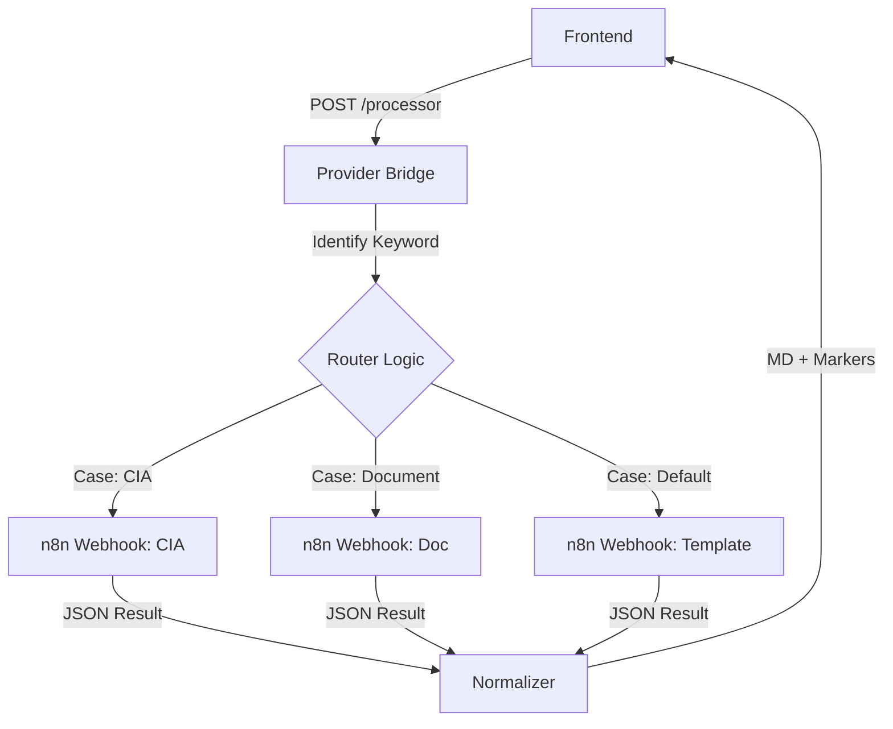

# 🏗️ Architecture du Micro-service N8N

Le N8N Processor est une couche d'abstraction (Bridge) qui se situe entre vos clients (Frontend, Mobile, autres API) et vos serveurs n8n.

## 🧱 Composants Principaux

1.  **Server Engine (Express.js)** : Reçoit les requêtes `POST /api/providers/n8n/processor`.
2.  **Smart Router (N8nService)** :
    -   Analyse l'intention de l'utilisateur.
    -   Sélectionne le webhook n8n approprié (parmi 15 cas configurés).
3.  **Data Normalizer** :
    -   Convertit les réponses brutes d'n8n (JSON, Array) en Markdown structuré.
    -   Injecte des marqueurs de composants UI (Accordéons).
4.  **External Webhooks** : Vos workflows réels tournant sur n8n.

## 🔄 Flux de Données

## 🔐 Sécurité

Le service utilise le système d'authentification centralisé du Provider Bridge :
-   **JWT Token** : Requis pour les appels authentifiés.
-   **Optional Auth** : Permet l'intégration rapide sans login si configuré.
-   **Usage Logging** : Chaque appel est enregistré par utilisateur pour les statistiques.

## ⚡ Performance

-   **Timeout Adaptable** : Configuré à 11 minutes pour supporter les longs traitements LLM.
-   **Stateless** : Le bridge ne stocke pas de session n8n, chaque message est routé indépendamment.
